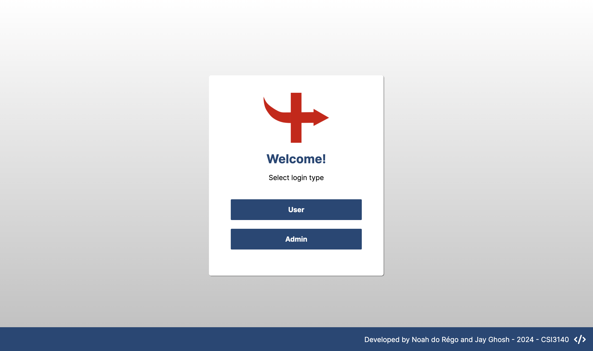
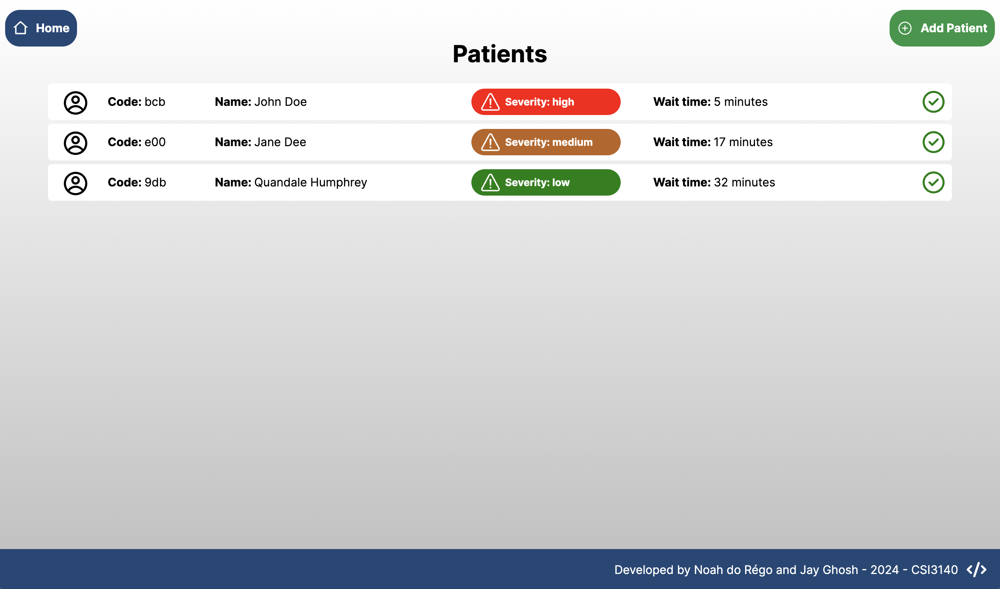
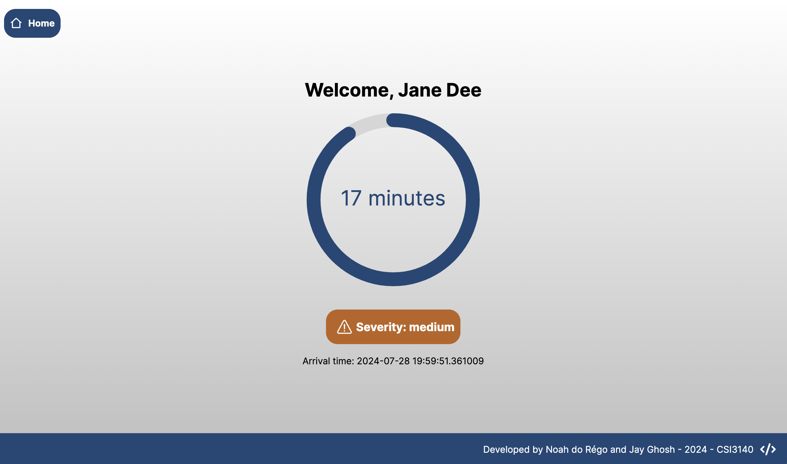
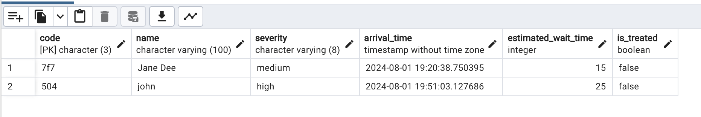

# Hospital Triage Application (CSI3140 A4)

This web application was made for assignment 4 of CSI3140 by Jay Ghosh and Noah do Régo. The admin user can add/admit patients to the triage queue,
and patients can log in using their assigned user code to see their wait time and severity. 

**Please note that the patient wait times update as follows:**

| When patients are added   | When patients are admitted |
| ------------------------- | -------------------------- |
| Critical severity: +5 min | Critical severity: -20 min |
| High severity: +10 min    | High severity: -15 min     |
| Medium severity +15 min   | Medium severity -10 min    |
| Low severity +20 min      | Low severity -5 min        |

**In accordance with Professor Kalonji Kalala's permission, we have used ReactJS for the frontend, PHP for the backend (with Composer), and Postgres for the database.**

## Installation

### Prerequisites

The following libraries, frameworks and tools must be installed in order to run the web app:

- PostgreSQL: can be download via website (https://www.postgresql.org/), and pgAdmin 4 can be downloaded to set up/manage the database (https://www.pgadmin.org/download/).
- Composer for php: Can be downloaded through their site (https://getcomposer.org/download/) or via homebrew on MacOS
- Node.js: Runtime engine for JS, used to run React (https://nodejs.org/en)

### Setting Up the Backend Application

Navigate to the `backend` directory. Then run the command `composer update` to install and update dependencies.

For this project, Postgres is being used for DB management. To properly set up and access the backend application, create the following file at the specific path: `backend/backend.env`.

In the file, enter the following data:

```env
DB_HOST=<your-db-host (default = localhost)>
DB_PORT=<your-db-port (default = 5432)>
DB_NAME=<your-db-name>
DB_USER=<your-db-user>
DB_PASSWORD=<your-db-password>
```

*IMPORTANT*: After the empty db is setup, please run the code in `setup.sql` to define the db tables and data. You can either run it using the psql terminal, or navigate to the correct db in pgAdmin
and copy/paste the code into the Query Tool (right-click public schema -> Query tool), then run the code. **If you don't do this step, the application will NOT work, because there will be no schema populated in the database to work with.**

Finally, to run the PHP backend server, navigate to `backend/public` and run the commmand `php -S localhost:<port>`, which starts the backend server on port `<port>` of your machine.

### Setting Up the Frontend Application

Navigate to the `frontend` directory. Then, run the following commands:

```
npm install # this will create node_modules folder and package-lock.json
npm start # this will start your react app
```

**After these exact steps have been completed, you should be able to access the whole application through the specified port outputted on** `npm start`

## Logins

- **To login as admin, use the following credentials: username = admin, password = adminCSI3140**
- To login as a user, use one of the user codes from the admin view

## Project Structure (important dirs & files)
## backend/
Backend application directory.

### db/
Database-related files.
- setup.sql: SQL script for database setup.

### public/
Publicly accessible files.
- index.php: Entry point for the backend application.

### src/
Source code for the backend.

#### Controllers/
Contains controller classes that handle requests and responses.
- AdminController.php: Handles admin-related operations.
- PatientController.php: Manages patient-related operations.

#### Services/
Service classes for business logic.
- DatabaseService.php: Manages database operations.

## frontend/
Frontend application directory.

### public/
Publicly accessible files for the frontend.

### src/
Source code for the frontend.

### components/
Reusable React components.
- AdminNavbar.js: Navigation bar component for admin interface.
- Button.js: Reusable button component.
- component_styles.css: CSS styles for components.
- Footer.js: Footer component.
- PatientRow.js: Component for displaying patient information in a row.
- Severity.js: Component related to severity levels.
- UserNavbar.js: Navigation bar component for user interface.

### images/
Static images used in the application.

### pages/
React components representing different pages of the application.
- AdminPage.js: Admin dashboard or admin-specific page.
- Login.js: Login page component.
- styles.css: CSS styles specific to pages.
- UserPage.js: User dashboard or user-specific page.

### App.js
Main React component that serves as the root of the application.

### index.css
Global CSS styles for the application.

## App Layout

Users must select the login type that they desire (patient/admin)

Admins must login with the appropriate credentials (username: admin / password: adminCSI3140)

Users must login with their assigned user code (can be viewed from the admin page).



### Admin Layout

Admins can add patients using the "Add Patient" button at the top right

Admins can view the queue of patients and admit them by selecting the checkmark next to a specific user's row.



### Patient Layout

Patients can login using their assigned user code to view their estimated wait time and other details.



### Database Schema Layout (example)




